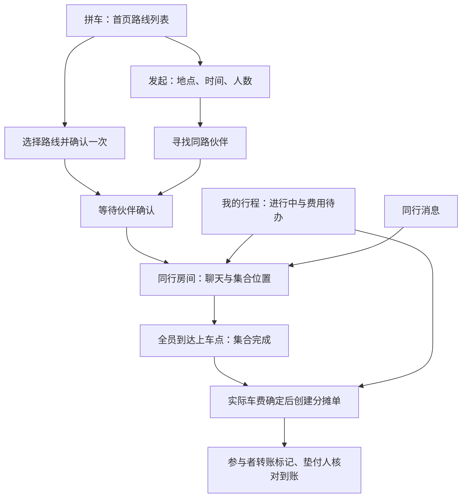
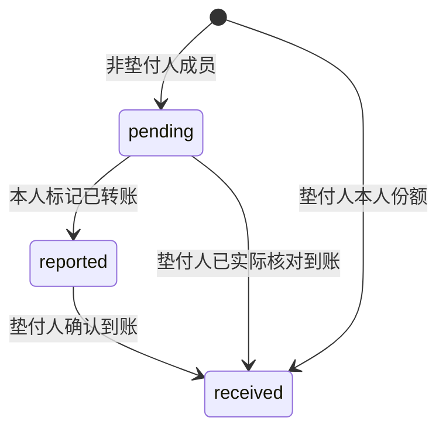

# 校园拼车产品需求文档（PRD）

> 文档版本：1.0｜基线日期：2026-09-25｜产品形态：微信小程序，附浏览器 Demo
>
> 本文依据当前界面、交互代码、业务规则和已确认的产品决策反向整理。当前交付是可交互 Demo；真实微信身份、云端多用户协作、设备定位和资金支付尚未完成上线验证。下文明确区分已有行为与后续需求。

## 1. 产品定义与交付边界

**校园拼车帮助澳门科技大学学生找到同路线、相近出发时间的同学，在同一房间沟通、集合并记录车费分摊。每趟最多六人，包含发起人。**

产品解决的是学生之间的同行协调。当前不提供司机接单、出租车调度、车辆预订或运力保证；同学仍需自行联系出租车。页面里的时间、人数和费用信息不能被解释为已经叫到车。

| 能力 | 当前结果 | 正式使用前的缺口 |
| --- | --- | --- |
| 发布、筛选、加入拼车 | Demo 可完整操作；有匹配及容量规则代码 | 云端部署、并发确认、真实多账号联调 |
| 同行聊天 | 示例消息、发送、模拟回复；有云端消息接口代码 | 真实账号互通、弱网与后台消息策略 |
| 集合位置 | 模拟地图、位置开关、到达状态；有前台定位代码 | 微信及设备权限真机验证、准确集合坐标 |
| 车费分摊 | 整分均摊、垫付人及参与者视角、模拟转账和到账确认 | 实际转账方案、争议处理、支付接入决策 |
| 校园身份 | 示例学生资料；真实模式有微信身份代码 | 微信身份不等于学生认证，校园认证方案待定 |
| 视觉及品牌 | 中文 Stitch 方案、墨绿车形 Logo、四个底部入口 | 不同机型与真实小程序环境的视觉验收 |

### 1.1 用户与典型场景

主要用户为澳门科技大学有通勤拼车需求的在校学生。需求来自校园与居住地、口岸之间的同行协调：学生目前分散在多个微信群里，需要反复询问路线、时间、人数和集合位置，付款后又要逐人催收。

| 场景 | 用户当下要完成的事 | 产品应提供的结果 |
| --- | --- | --- |
| 下课准备回住处 | 找到近期同路同学 | 看到可加入路线，核对一次后申请同行 |
| 约定时间去口岸 | 提前发布出发计划 | 设置路线、时间与人数上限，等待同路匹配 |
| 临近集合 | 找到同车伙伴 | 房间内沟通、查看自愿共享的位置、标记到达 |
| 一人垫付车费 | 让每人知道应付多少 | 生成公开分摊明细，逐人记录转账与到账 |
| 暂时离开页面 | 回来继续刚才的事 | 在首页、我的行程或同行消息中恢复上下文 |

### 1.2 目标与非目标

本阶段目标：把找人、确认、集合沟通和费用记录串成一条可体验的路径，减少重复确认和跨群联系；用 Demo 验证信息层级、按钮去向及关键业务规则。

正式版目标：让真实学生能够稳定完成同一条路径，并确保人数、成员权限、位置共享和费用状态在各端一致。

本期不包含司机端、平台代叫车、车辆轨迹跟踪、后台持续定位、自动扣款、汇率换算、积分奖励、真实评分体系及校方背书。没有证据的能力不通过“已认证”“已支付”等文案暗示已完成。

## 2. 信息架构与主要旅程

底部固定四个 Tab：**拼车 / 我的行程 / 同行消息 / 我的**。不新增单独的发布 Tab；发起入口为首页浮动按钮。

**“集合完成”只表示伙伴在上车点集合完成，不代表已抵达乘车目的地，也不代表车费已付清。** 目前代码使用 `completed` 保存集合完成状态，产品文案及后续统计都必须按上述含义理解。

| 页面 | 主要内容 | 主要操作及返回 |
| --- | --- | --- |
| 拼车首页 | 品牌栏、校园说明、当前行程入口、筛选、路线列表 | 申请同行、发起拼车；有当前行程仍保留列表 |
| 发布/编辑 | 起终点、出发时间、总人数上限、同路推荐 | 发布、保存修改、返回列表 |
| 拼车广场 | 可加入的路线列表 | 核对后加入；返回实际来源页 |
| 寻找/确认 | 等待进度、参与人、出发时间、确认状态 | 确认、拒绝重找、修改或取消 |
| 同行房间 | 集合点、到达人数、聊天、位置、费用入口 | 沟通、共享位置、标记到达、取消或退出 |
| 费用分摊 | 本人份额、总额、成员明细、转账/到账状态、反馈 | 创建费用单、标记转账、确认到账、返回行程 |
| 我的行程 | 进行中与待办、历史记录 | 直达房间或费用单 |
| 同行消息 | 各同行房间的会话和最近消息 | 进入对应房间，返回会话列表 |
| 我的 | 头像、昵称、位置设置、历史行程、Demo 重置 | 修改资料与设置 |

### 2.1 缩短旅程的已确认决策

- 起终点共用“搜索/选择/自定义地点”抽屉，不保留“常用 / 自己打”模式切换。
- 从公开路线加入时，“确认同行”即记录申请人的同意；等待伙伴回应时不要求申请人再确认一次。
- 自行发布后的自动匹配保留确认步骤，避免未核对时间就进入他人房间。
- 集合说明常驻房间；底部提供“我已到达上车点”，全员到达后不再额外要求“开始乘车”才能查看费用待办。
- 费用待办直达分摊页；详情返回来源页，避免一律跳回首页。
- 移除介绍弹窗和面向开发人员的服务自检界面。Demo 属性保留在相关说明中。

## 3. 页面与功能需求

需求编号用于开发和验收追踪。“现有”指当前 Demo 已具备该行为，不表示生产服务已上线。

### 3.1 首页与路线列表

| 编号 | 需求及规则 | 当前状态 |
| --- | --- | --- |
| HOME-01 | 首页名称为“校园拼车”，使用当前墨绿车形 Logo；保留四个指定 Tab | 现有 |
| HOME-02 | 展示出发时间、起终点、集合说明、当前人数/上限、空余席位、发起人和加入入口 | 现有 |
| HOME-03 | 筛选提供全部路线、横琴口岸、擎天汇、科大；匹配起点或终点文本 | 现有；非地图距离筛选 |
| HOME-04 | 示例价格明确写“/人示例预估”；最终份额由费用单决定 | 现有；无实时计价服务 |
| HOME-05 | 无当前需求时浮动按钮进入发布；有当前需求时导向当前行程，避免重复发布 | 现有 |
| HOME-06 | 有当前行程时显示紧凑的继续行程入口，仍可浏览其他公开路线 | 现有 |
| HOME-07 | 已有当前需求再尝试加入另一条路线时，提示并进入当前需求，不静默取消旧需求 | 现有 |
| HOME-08 | 满员、结束或已加入的路线不可再次加入；列表与确认动作均需检查容量和状态 | Demo 已有，生产并发待验收 |
| HOME-09 | 没有符合筛选的路线时展示空状态和发起入口，不保留无效卡片 | 现有 |

首页展示的是同行人数和人数上限，不保证某种车型，也不证明已预订车辆。座位条需与实际成员数一致。

### 3.2 发布、地点与时间

| 编号 | 需求及规则 | 当前状态 |
| --- | --- | --- |
| PUB-01 | 点击起点或终点打开同一个地点抽屉，支持搜索、别名、最近地点和明确选择自定义输入 | 现有 |
| PUB-02 | 常用地点含科大 A 座、R 座、TIS、擎天汇和横琴口岸，提供常用方向组合 | 现有 |
| PUB-03 | 可以交换起终点；归一化后起终点不能相同 | 现有 |
| PUB-04 | 自定义地点不伪装成经过地图服务验证的地址；成员通过集合说明约定具体上客点 | 现有 |
| PUB-05 | 时间支持现在出发、15 分钟后、预约日期和时间 | 现有 |
| PUB-06 | 出发时间必须在未来七天内；“现在出发”当前按约两分钟后处理，预留发布时间 | 现有实现约定 |
| PUB-07 | 总人数默认 2，可选 2～6，包含本人；不提供“本人之外再加六人”的语义 | 现有 |
| PUB-08 | 编辑时展示同方向、前后 15 分钟的同路推荐 | 现有 |
| PUB-09 | 发布前保存上次路线、人数和最近地点；提供返回列表或取消编辑入口 | 现有 |
| PUB-10 | 仅未组成多人同行且无费用单时，可修改路线和时间；修改应清除旧匹配和旧确认 | 现有 |

### 3.3 匹配、申请与成员权限

匹配按**同起点、同终点、同方向**判断，别名先归一化。优先完全相同的出发时间，其次选择时间差在正负 15 分钟内的需求，边界包含 15 分钟。当前不根据地图距离、途经点或绕路成本推荐。

| 编号 | 需求及规则 | 当前状态 |
| --- | --- | --- |
| MATCH-01 | 匹配不超出参与需求的人数上限，绝对上限为六人；不加入重复成员 | 业务代码及测试已有 |
| MATCH-02 | 单人发布后进入寻找状态，找到伙伴后展示所有参与人及各自出发时间 | 现有 |
| MATCH-03 | 所有参与本次匹配的成员确认后才组成同行；一人的确认不能代表其他人 | Demo 模拟他人确认；真实云模式待联调 |
| MATCH-04 | 广场申请人核对一次即视为本人同意，仍需等待伙伴确认 | 现有 |
| MATCH-05 | 加入公开路线后保留原房间和原发起人，人数同步更新；不把加入者升级为发起人 | Demo 已修复并有回归测试 |
| MATCH-06 | 拒绝后重新寻找；取消、拒绝或修改时释放旧匹配，过期异步回调不能恢复被取消的需求 | 现有规则；生产竞态待验收 |
| MATCH-07 | 发起人可取消整趟；普通成员只能退出自己，其他成员仍继续同行 | 现有 |
| MATCH-08 | 退出后撤销本人位置及房间访问权；不能继续读取成员聊天和费用详情 | 业务规则已有 |
| MATCH-09 | 单个用户只能有一趟当前进行中的需求；历史费用待办不阻塞下一趟发布 | 现有；Demo 另有独立展示案例 |

**Demo 与生产代码的差异：** Demo 按定时任务产生伙伴并模拟同意，不是真实全局匹配。生产代码中自动合并会选定主房间并采用双方较小的容量；正式接入时须确认公开加入也始终符合“保留原路线发起人”的产品规则，包括双方均为单人的情况。

### 3.4 同行房间与聊天

| 编号 | 需求及规则 | 当前状态 |
| --- | --- | --- |
| ROOM-01 | 房间展示集合点、出发时间、同行人数和已到达人数 | 现有 |
| ROOM-02 | 集合期间仅发起人可修改集合说明，最多 60 字；保存后产生系统消息 | 现有 |
| CHAT-01 | 已组成同行的成员可发送文字消息，展示发送人、时间及内容 | 现有 |
| CHAT-02 | 消息非空、最多 500 字；重试同一消息编号时不重复保存 | 业务规则已有 |
| CHAT-03 | 提供“我快到了”“在集合点等你”等快捷表达 | 现有，两端文案略有差别 |
| CHAT-04 | 同步消息时不覆盖正在输入的内容；已有阅读位置不应被无条件跳到底部 | 网页已处理输入保护，真机需验收 |
| CHAT-05 | 结束集合后保留聊天和费用记录 | 现有 |
| CHAT-06 | 同行消息页按房间进入会话，显示最近一条消息 | 现有 |

当前消息最多保留最近 100 条。Demo 约 1.2 秒后产生模拟回复；网页约 0.9 秒、小程序 Demo 约 0.8 秒刷新状态。真实小程序代码为前台约 3 秒轮询。**尚未接入 WebSocket、微信订阅消息、离线通知、消息送达回执和跨设备未读数。**

### 3.5 定位授权、共享与集合

首次进入且未获授权时展示：

- 标题：**请开启定位权限**。
- 灰色说明：**允许科大拼车使用你的定位**。
- 操作：**暂不开启 / 去设置**。

当前兼容文案仍使用“科大拼车”；首页及对外名称已为“校园拼车”，正式发布前需统一名称，这是文案收尾项。

| 编号 | 需求及规则 | 当前状态 |
| --- | --- | --- |
| LOC-01 | 暂不开启只关闭弹窗，不读取位置，不阻塞浏览、选地点和发布 | 现有 |
| LOC-02 | Demo 的去设置打开允许/不允许选项，选择后保存本机状态，不读取真实 GPS | 现有 |
| LOC-03 | 正式模式走微信授权和设置流程，最终状态以微信返回为准，不仿造系统授权结果 | 代码已有，真机待验收 |
| LOC-04 | 获得定位权限不等于同意共享；共享默认关闭，由本人在同行房间另行开启 | 现有 |
| LOC-05 | 共享仅用于本次集合伙伴；关闭共享、离开房间、切到后台、退出或结束集合应停止 | 现有控制，真实生命周期待验收 |
| LOC-06 | 真实代码前台约 15 秒更新一次位置；超过 90 秒未更新的位置不展示 | 代码已有，非实时追踪保证 |
| LOC-07 | 未授权、定位失败或无人共享时有可理解的状态，用户仍可通过聊天和集合说明集合 | 需真机覆盖失败场景 |
| MEET-01 | 本人可标记“我已到达上车点”，全员到达后自动结束集合并停止位置共享 | 现有；Demo 在本人到达后模拟伙伴到达 |
| MEET-02 | 到约定出发时间后 30 分钟仍未结束的集合自动超时收尾 | 业务规则已有；云端定时任务待部署 |

地图在 Demo 中为模拟示意，不表示真实位置或导航路线。真实代码具有定位和地图显示入口，但尚未接入地图地址搜索、准确上客点地理编码、路线导航或后台持续定位。

### 3.6 费用分摊与到账记录

费用流程在实际车费确定并由某位同学垫付后发起。当前界面允许集合完成后创建费用单，尚无技术手段验证是否已乘车或真实垫付。

| 编号 | 需求及规则 | 当前状态 |
| --- | --- | --- |
| BILL-01 | 同行成员可作为垫付人发起分摊；发起人身份与垫付人身份独立 | 现有 |
| BILL-02 | 输入总车费，币种为 MOP，范围 0.01～9999.00，最多两位小数 | 现有 |
| BILL-03 | 提交前预览每个人的金额，参与人数包含垫付人本人 | 现有 |
| BILL-04 | 按整数分均摊，余下不足一人一分的尾差按成员顺序逐分分配，总额严格守恒 | 现有 |
| BILL-05 | 同一行程只创建一张费用单；当前无修改、撤销、退款或补收入口 | 现有边界 |
| BILL-06 | 分摊页突出本人份额，展示总车费、人数、垫付人及各人的状态 | 现有 |
| BILL-07 | 参与者只标记自己的转账；垫付人确认其他成员到账，普通成员不能代替确认 | 现有 |
| BILL-08 | 垫付人自身份额直接计入已确认，无需向自己转账；计数含本人 | 现有 |
| BILL-09 | 待办继续保留未创建费用单、待转账、待核对到账或未收齐的记录 | 现有 |
| BILL-10 | 微信转账及 MPay 面板为演示入口；可模拟转账状态，但不提供真实收款码、不扣款 | 现有 Demo |
| BILL-11 | 同行反馈标签可选择、取消及本机保存；无积分、全站评分或公开评价 | 现有 Demo |

例：120.01 MOP 由三人分摊，份额为 **40.01 / 40.00 / 40.00 MOP**，总和为 120.01 MOP。不得用显示四舍五入后各人金额相加产生尾差。

`reported` 是参与者的操作记录，不能自动等同于资金到账。Demo 会为部分场景自动模拟确认；正式版必须由实际到账核对或经确认的支付结果驱动。

“群收款”在本版体现为**小程序内的多人分摊记录**，尚未接入微信原生群收款、商户支付或 MPay 支付。正式收款方案、币种及账号体系须另行定稿；本文不承诺可直接调用特定支付接口。

### 3.7 我的行程、资料与 Demo 重置

| 编号 | 需求及规则 | 当前状态 |
| --- | --- | --- |
| TRIP-01 | 进行中与待办展示活动集合及有费用事项的记录；集合结束且本人无费用待办的记录归入历史；垫付人需等待全部收齐 | 现有 |
| TRIP-02 | 点费用任务直接打开对应账单；未创建费用单时进入创建入口 | 现有 |
| PROFILE-01 | 我的展示头像和昵称，允许修改；昵称为 1～12 字 | 现有 |
| PROFILE-02 | 提供位置信息设置和历史行程入口 | 现有 |
| DEMO-01 | 重置需二次确认，清除本次演示操作并恢复示例行程、消息和费用 | 现有 |
| DEMO-02 | Demo 数据按设备保存，重新载入时超过 12 小时会重建示例时间与数据 | 现有；非正式数据保留策略 |

## 4. 角色、状态与数据规则

### 4.1 角色权限

| 操作 | 公开浏览者 | 同行成员 | 发起人 | 垫付人 |
| --- | --- | --- | --- | --- |
| 看公开路线摘要 | 可以 | 可以 | 可以 | 可以 |
| 读房间聊天、位置和账单明细 | 不可以 | 仅本人所在房间 | 仅本人所在房间 | 仅本人所在房间 |
| 修改集合说明 | 不可以 | 不可以 | 集合期间可以 | 仅同时为发起人时 |
| 取消整趟拼车 | 不可以 | 不可以 | 集合期间可以 | 仅同时为发起人时 |
| 退出本人 | 不适用 | 集合期间可以 | 使用取消整趟 | 账单产生后不支持退出 |
| 自愿共享本人位置、标记到达 | 不可以 | 集合期间可以 | 同左 | 同左 |
| 创建首张费用单 | 不可以 | 符合创建条件时可以 | 同左 | 创建者即为垫付人 |
| 标记本人已转账 | 不可以 | 本人有待付份额时 | 不是垫付人且有待付份额时 | 本人不需要 |
| 确认他人到账 | 不可以 | 不可以 | 仅同时为垫付人时 | 可以 |

### 4.2 面向用户的状态

| 状态 | 进入条件 | 允许的主要行为 |
| --- | --- | --- |
| 寻找同行 | 发布成功，尚无多人同行或有效匹配确认 | 等待、修改、取消 |
| 等待确认 | 已生成匹配，尚未全员确认 | 核对、确认、拒绝重找 |
| 集合中 | 全员确认形成同行 | 聊天、共享、到达、按角色退出或取消 |
| 集合完成 | 两人及以上全部标记到达 | 聊天、创建或处理费用 |
| 已取消 | 发起人取消 | 查看保留记录，不重新招募 |
| 已超时 | 达到约定出发时间后 30 分钟 | 查看保留记录，不继续共享 |
| 费用待办 | 集合已结束但费用尚未处理完 | 按本人角色完成费用操作 |
| 历史 | 集合已结束且无费用待办 | 查看记录 |

费用状态独立于集合状态。已完成集合不代表结清；费用结清也不应把取消或超时改写成“成功乘车”。合并产生的临时房间为内部重定向记录，不应作为重复行程显示。

### 4.3 核心数据概念

| 对象 | 必要信息 | 约束 |
| --- | --- | --- |
| 用户 | 稳定标识、昵称、头像 | 学生认证信息与微信标识分开，认证尚未实现 |
| 行程/房间 | 起终点、出发时间、人数上限、发起人、集合说明、状态、成员 | 时间与容量校验；同一成员不重复 |
| 成员 | 用户标识、显示名、是否到达 | 退出后撤销访问与位置 |
| 匹配候选 | 参与房间、参与人、各自时间、确认名单 | 全员确认及事务容量检查 |
| 消息 | 消息编号、房间、发送者、内容、时间 | 重试幂等、长度限制、成员可见 |
| 共享位置 | 成员、经纬度、精度、更新时间 | 显式开启、限房间、过期隐藏 |
| 费用单 | 总额整分、币种、垫付人、成员份额与状态 | 一趟一单、金额守恒、操作权限 |
| 同行反馈 | 房间、选中标签 | 当前仅本机保存，不形成公众评分 |

## 5. 视觉与交互约束

- 采用已确认的中文版 Stitch 方向：墨绿主色、灰白背景、白色圆角卡片、浅阴影、黑色选中筛选和浮动发布按钮。
- 首页路线卡恢复原始 24px 圆角和 20px 内边距；费用卡 28px 圆角，金额突出。小程序按对应 rpx 实现，真机显示仍需验收。
- 使用精简后的墨绿车形 Logo：三个路线节点、统一圆形车轮。小程序品牌栏为微信原生胶囊预留区域。
- 原生小程序使用四个原生 Tab；网页预览复现同一信息架构，不把浏览器 Demo 当作已上线小程序。
- 长地点和昵称不能挤出关键按钮；键盘弹起、刘海屏及底部安全区不遮挡主要操作。
- 状态通过文字和图形共同表达；不能仅依赖颜色区分待付与到账。
- 弹窗可关闭；返回需恢复实际来源，不清空尚未提交的输入上下文。
- 已有服务错误提供可理解的提示；开发调试详情不放入学生主流程。

## 6. 异常与上线验收

### 6.1 关键异常处理

| 场景 | 预期行为 |
| --- | --- |
| 卡片展示后路线已满或结束 | 服务器拒绝加入并刷新状态，不产生幽灵成员 |
| 双方同时确认/多人同时加入 | 只成功一次，最终人数不超限；其他申请得到明确反馈 |
| 等待期间改路线或拒绝 | 旧伙伴、预确认和定时回调失效，不被带入新路线 |
| 发布按钮重复点击、网络重试 | 不重复创建需求；生产端幂等需纳入联调 |
| 输入消息时收到更新 | 输入及焦点保留，消息列表按阅读状态更新 |
| 定位拒绝或设备关闭定位 | 共享不开启，可继续聊天和手动集合；不显示伪造的真实位置 |
| 切后台、退出房间或集合完成 | 停止位置上传，按规则撤销或过期隐藏位置 |
| 退出普通成员 | 原房间继续存在，人数减少；本人失去私有内容访问权 |
| 金额为空、负数、超过两位小数或超上限 | 不创建账单，提示可输入范围 |
| 重复建账或非垫付人确认到账 | 拒绝操作，不覆盖原费用和状态 |
| 集合超时但实际仍需同行 | 当前只收尾；延期/恢复及重新组队策略待正式版明确 |
| 错填账单、转错金额或争议 | 当前没有自助纠错机制；正式上线前必须明确处理入口 |

### 6.2 核心验收用例

| 编号 | 操作与输入 | 通过标准 |
| --- | --- | --- |
| AC-01 | 未授权首次打开，选择暂不开启 | 无真实定位调用，仍能浏览与发布 |
| AC-02 | 输入 TIS 等别名，交换地点，选择自定义地点 | 识别/保存正确，不出现“自己打”双模式 |
| AC-03 | 选择人数 2、6、非法 7；相同起终点；过去或七天外时间 | 合法值可提交，非法值有提示且无新增需求 |
| AC-04 | 同方向时间差 0、15、超过15分钟及反方向 | 只匹配规定范围；同时间优先 |
| AC-05 | 广场加入一次确认，等待所有伙伴回应 | 无重复本人确认，最终保留原发起人和房间 |
| AC-06 | 加入后回首页 | 当前行程入口与其他路线同时存在 |
| AC-07 | 加入等待期间修改路线 | 原路线解除占用，旧伙伴不自动加入新路线 |
| AC-08 | 普通成员退出/尝试取消整趟 | 退出只移除本人；取消整趟被拒绝 |
| AC-09 | 从我的行程进费用、从消息进房间、从发布进广场再返回 | 各自回到正确来源，发布表单有返回入口 |
| AC-10 | 发消息、重试相同编号、发送501字、输入时刷新 | 正常消息可见、不重复、不超限、不丢输入 |
| AC-11 | 未开启共享、主动开启、切后台、90秒无更新 | 不越权共享；离开停止；过期位置不可见 |
| AC-12 | 全员到达与出发时间后30分钟超时 | 分别进入集合完成或超时，不继续共享 |
| AC-13 | 三人分摊120.01 MOP | 40.01/40.00/40.00，总额一致，包含垫付人 |
| AC-14 | 参与者标记转账、他人尝试确认、垫付人确认 | 角色权限正确，标记与到账状态分离 |
| AC-15 | 打开微信/MPay Demo 面板并模拟转账 | 无真实扣款，账单按模拟流程更新 |
| AC-16 | 重置 Demo | 经确认恢复示例，未重置前刷新可恢复本机状态 |
| AC-17 | 小屏、长文案、键盘及安全区 | 卡片与操作不遮挡，Logo 和四个 Tab 正常显示 |

已有验证记录为 **37 项业务单元测试通过**，并进行过网页 DOM 旅程、小程序逻辑模拟、JavaScript/JSON 检查及 WXML/WXSS 编译。自动浏览器启动失败，当前缺少本轮渲染截图；尚未完成真机视觉验收、真实双账号联调、云事务并发、真实定位或支付验收。上述用例不能全部标为生产已通过。

## 7. 正式版优先级与待决策事项

### 7.1 优先级

| 优先级 | 工作项 | 完成定义 |
| --- | --- | --- |
| P0 | 明确账号和校园准入方式 | 登录流程、可见信息、学生资格与退出机制确定，界面不作虚假认证宣称 |
| P0 | 部署云环境并完成双账号闭环 | 发布—全员确认—聊天—集合—账单在两个真实账号间同步 |
| P0 | 验证容量、身份及状态一致性 | 并发加入、取消、编辑、退出不会超员、越权或留下旧匹配 |
| P0 | 真机定位与地图 | 权限、前后台切换、失效时间、集合坐标及拒绝路径验收通过 |
| P0 | 明确支付边界和账单纠错 | 首版是线下转账记录还是接入支付被明确；错单和争议有处理方式 |
| P0 | 完成机型视觉与交互验收 | 按两张中文参考及本 PRD 验收首页、费用页和完整旅程 |
| P0 | 明确数据使用及保留 | 位置、消息、头像与账单的访问、保留、删除和说明一致 |
| P1 | 离线通知与未读状态 | 用户离开页面仍能按已授权方式收到关键提醒，重试不重复通知 |
| P1 | 地点服务与准确集合点 | 自定义地点可确认准确位置，补充真实上客点，减少集合歧义 |
| P1 | 超时、爽约和纠纷处理 | 取消通知、重新组队及投诉入口有明确规则 |
| P1 | 消息与列表扩展 | 分页、消息独立存储及性能验证支持计划内的内测规模 |
| P2 | 基于数据改进推荐 | 有真实样本后评估常用路线、预约与匹配排序，不预设算法效果 |

### 7.2 需要产品负责人定稿

1. 是否只允许本校学生使用；如是，如何核验，而非仅凭微信登录。
2. 谁负责实际叫车，是否需要“已联系车辆”信息；目前没有对应闭环。
3. 正式版是否保留“全员到达上车点即集合完成”，是否需要额外乘车状态。
4. 超时、成员迟到、临时退出和取消怎样通知，是否允许延期。
5. 首版费用采用线下转账记录，还是接入真实支付；采用什么收款主体、币种与方式。
6. 一趟一单生成后的纠错、退款、补收和争议如何处理。
7. 消息、位置和费用记录保留多久，用户如何删除或申请处理。
8. 内测人数、目标设备、正式发布日期和验收负责人；当前未设定。

## 8. 成效指标与埋点建议（未接入）

先验证是否减少协调成本，再评估规模。当前没有真实用户数据，不能给出转化率、节省车费或满意度结论。

| 指标 | 口径 | 用途 |
| --- | --- | --- |
| 首次同行达成时间 | 用户首次提交有效需求至全员确认的时长 | 判断匹配与操作等待是否过长 |
| 同行达成率 | 形成两人以上同行的有效需求数 / 有效需求数，排除 Demo | 衡量供需匹配 |
| 集合完成率 | 全员到达的同行房间数 / 已确认同行房间数 | 判断沟通和集合效果 |
| 费用结清率 | 非垫付人成员均确认到账的费用单数 / 有待收份额的费用单数 | 衡量分摊闭环 |
| 关键步骤流失 | 查看路线、核对、提交、确认、进入房间各步的转化 | 定位不必要步骤 |
| 协调失败原因 | 超时、主动取消、容量变化、定位失败等事件分布 | 决定下一轮优先级 |

建议事件：`ride_publish`、`join_submit`、`match_confirm`、`match_decline`、`room_joined`、`member_arrived`、`gathering_completed`、`ride_cancelled`、`ride_timeout`、`bill_created`、`payment_reported`、`payment_confirmed`。只记录完成统计所需的标识、时间和结果；不把聊天原文或精确位置加入普通行为埋点。指标目标在真实内测基线形成后另定。

## 附录：反推依据与差异说明

本 PRD 以 **2026-09-25 当前交付工程**为依据，优先采用实际实现及用户已确认决策；旧 README 个别条目落后于最终修正，不作为唯一事实来源。

| 依据 | 对应范围 |
| --- | --- |
| `miniprogram/app.json`、`pages/`、`templates/main.wxml` | 四 Tab、原生页面及交互入口 |
| `miniprogram/lib/page.js`、`presentation.js` | 页面状态、地点、费用待办与导航行为 |
| `miniprogram/lib/demo.js`、`miniprogram/config.js` | 本机 Demo、定时模拟、数据持久化、重置 |
| `miniprogram/lib/location-permission.js` | 定位许可和微信设置流程 |
| `cloudfunctions/ride/domain.js`、`matching.js` | 金额、权限、时间窗口、合并和超时规则 |
| `preview/app.js`、`preview/style.css` | 浏览器 Demo、来源页返回、当前行程入口和视觉基线 |
| `tests/*.test.js` | 已有业务规则及回归测试 |
| 用户批准的中文 Stitch 方案及精简 Logo | 视觉方向与品牌外观 |

生产代码保留了 `going`、手动开始/结束及申请审核等早期能力，但当前学生界面没有全部暴露；本文不把未暴露入口列为已交付功能。Demo、云端骨架和未来正式版的差异须在接入前逐项对齐，不能仅切换配置就视作完成上线。
